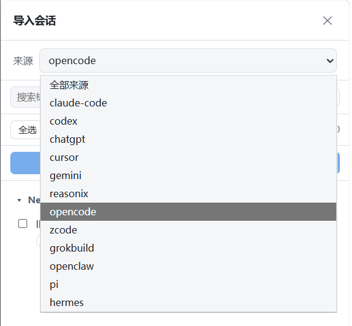

<p align="center">
  <a href="README.md">English</a> | <a href="README.zh-CN.md">绠€浣撲腑鏂?/a>
</p>

<p align="center">
  
</p>

# DSH Chat Import

> **涓€涓彃浠讹紝13 绉嶆潵婧?* 鈥斺€?鍏ㄤ繚鐪熷鍏?DeepSeek Harness锛屾棤缂濈画鑱婏紝骞跺彲瀵煎嚭 / 鍚屾鍥?Claude Code銆?
<p align="center">
  <a href="https://www.npmjs.com/package/dsh-chat-import"></a>
  <a href="https://www.npmjs.com/package/dsh-chat-import"></a>
  <a href="LICENSE"></a>
  <a href="package.json">= 22.13"></a>
  <a href="https://github.com/Nwflower/dsh-chat-import/actions/workflows/ci.yml"></a>
  <a href="https://github.com/Nwflower/dsh-chat-import"></a>
  <a href="https://awesome-dsh-plugin.com"></a>
</p>

<p align="center">
  <b>宸叉敹褰曚簬锛?/b> <a href="https://github.com/0xsline/awesome-deepseek-harness">Awesome DeepSeek Harness</a> 路 <a href="https://github.com/awesome-dsh-plugin/awesome-dsh-plugin">Awesome DSH Plugin</a> 路 <a href="https://github.com/Dominic789654/awesome-deepseek-harness">Awesome DSH Plugins</a> 路 <a href="https://www.npmjs.com/package/dsh-chat-import">npm</a>
  &nbsp;&nbsp;路&nbsp;&nbsp; <b>鏇存柊鏃ュ織锛堣嫳鏂囷級锛?/b> <a href="CHANGELOG.md">CHANGELOG.md</a>
</p>
`dsh-chat-import` 浠?**Claude Code銆丆odex銆丆hatGPT銆丆ursor銆丟emini銆丷easonix銆乷pencode銆乑Code銆丟rok Build銆丱penClaw銆丳i Coding Agent銆丠ermes 涓?Kimi CLI** 瀵煎叆鑱婂ぉ鍘嗗彶鈥斺€斿伐鍏疯皟鐢ㄣ€佹€濊€冭繃绋嬩竴搴斾勘鍏ㄢ€斺€旀垚涓?*鍏ㄤ繚鐪熴€佸彲缁х画锛坮esume锛夌殑 DeepSeek Harness 浼氳瘽**銆傛簮鏂囦欢**鍙**璇诲彇锛堢粷涓嶆敼鍐欙級锛屼笉纰?DSH 寮曟搸锛涙瘡娆″鍏ラ兘鎴愪负涓€鏉″叏鏂颁細璇濓紝骞舵寜婧?`cwd` 褰掑叆瀵瑰簲宸ヤ綔鍖恒€?


鍙嶅悜鏂瑰悜鍚屾牱瑕嗙洊锛歚export_claude` 鎶?DSH 浼氳瘽搴忓垪鍖栧洖 Claude Code JSONL锛堝彧璇烩€斺€旂粷涓嶄慨鏀逛綘鐨?DSH 鏃ュ織锛夛紝Claude Code 鍙敤 `--resume` 鍔犺浇缁亰锛沗sync_to_claude` 鍐嶆妸浼氳瘽鏂板杞澧為噺鍐欏洖 Claude Code 鏂囦欢鈥斺€斿甫瀹堝崼銆佺粷涓嶉潤榛樿鐩栥€?
## 鉁?鍔熻兘鐗规€?
**馃摜 瀵煎叆**

- **13 绉嶆潵婧愶紝涓€涓彃浠?* 鈥?姣忕鏉ユ簮涓€鏉″懡浠わ紝浠?Claude Code JSONL銆丆odex rollout 鍒?SQLite 鏁版嵁搴撲笌浼氳瘽鐩綍銆?- **馃攳 鍏ㄤ繚鐪?* 鈥?宸ュ叿璋冪敤涓庣粨鏋溿€佹€濊€冨潡銆佹爣棰樸€佹ā鍨嬩笌鏃堕棿鎴筹紝婧愭湁璁板綍灏卞師鏍蜂繚鐣欍€?- **馃摝 鎵归噺瀵煎叆** 鈥?鎸囧悜涓€涓洰褰曪紙鎴栨暣涓暟鎹簱锛夛紝姣忎釜鏂囦欢 / 姣忔瀵硅瘽閮芥垚涓虹嫭绔嬩細璇濓紝骞惰繑鍥為€愭枃浠舵眹鎬汇€?
**鈻讹笍 缁亰**

- **鍙棤缂濈画鑱?* 鈥?鎵撳紑瀵煎叆鐨勪細璇濓紝浠庢簮璁板綍鍋滀笅鐨勫湴鏂圭户缁璇濄€?- **馃梻 鑷姩褰掔粍宸ヤ綔鍖?* 鈥?浼氳瘽鎸夋簮 `cwd` 鎸傝繘瀵瑰簲宸ヤ綔鍖猴紙鏈満鏃犳璺緞鏃跺洖閫€鍒版簮鏂囦欢鎵€鍦ㄧ洰褰曪級鈥斺€斾笉鍐嶃€屾湭鍒嗙粍銆嶃€?
**馃攧 鍙嶅悜**

- **馃摛 瀵煎嚭鍥?Claude Code** 鈥?`export_claude` 鎶婁换鎰?DSH 浼氳瘽锛堝鍏ョ殑鎴栧師鐢熺殑锛夊啓鍒?`<outputDir>/<slug>/<uuid>.jsonl`锛屽彲鐩存帴 `--resume`銆?- **馃攧 鍙嶅悜鍚屾** 鈥?`sync_to_claude` 鎶婁細璇濇柊澧炲畬鏁磋疆娆¤拷鍔犲洖 Claude Code 鏂囦欢鈥斺€斿甫瀹堝崼銆佺粷涓嶈鐩栥€?
**馃洝锔?淇濇姢**

- **馃攣 骞傜瓑 + 澧為噺** 鈥?閲嶅瀵煎叆鏈彉鍖栫殑婧愮洿鎺ヨ烦杩囷紱澧為暱鐨勬簮鍙拷鍔犳柊澧炶疆娆°€?- **馃М 涓婁笅鏂囬绠椾繚鎶?* 鈥?瓒呴暱浼氳瘽鎸夊畨鍏ㄤ笂涓嬫枃棰勭畻瑁佸壀锛岃鍓粨鏋滄樉寮忎笂鎶ャ€?
## 馃梻 鏀寔鐨勬潵婧?
| 鏉ユ簮 | 瀛樺偍浣嶇疆 | 瀵煎叆宸ュ叿 |
| --- | --- | --- |
| **Claude Code** | `~/.claude/projects/<slug>/<sessionId>.jsonl` | `import_claude` |
| **Codex / ChatGPT CLI** | `~/.codex/sessions/YYYY/MM/DD/rollout-*.jsonl` | `import_codex` |
| **ChatGPT**锛堢綉椤靛鍑猴級 | 瀵煎嚭鍘嬬缉鍖咃紙浠绘剰璺緞锛夆€斺€擿conversations.json` | `import_chatgpt` |
| **Cursor** | `~/.cursor/projects/<slug>/agent-transcripts/<id>/<id>.jsonl` | `import_cursor` |
| **Gemini CLI** | `~/.gemini/history/<slot>/chats/session-*.json` | `import_gemini` |
| **Reasonix** | `~/.reasonix/sessions/desktop-*.jsonl` | `import_reasonix` |
| **opencode** | `~/.local/share/opencode/opencode.db` | `import_opencode` |
| **ZCode**锛坺.ai CLI锛?| `~/.zcode/cli/db/db.sqlite` | `import_zcode` |
| **Grok Build** | `~/.grok/sessions/<project>/<session_id>/` | `import_grokbuild` |
| **OpenClaw** | `~/.openclaw/agents/<agent>/sessions/*.jsonl` | `import_openclaw` |
| **Pi Coding Agent** | `~/.pi/agent/sessions/--<cwd>--/<timestamp>_<uuid>.jsonl` | `import_pi` |
| **Hermes** | `~/.hermes/`锛圵indows `%LOCALAPPDATA%\hermes`锛?| `import_hermes` |
| **Kimi CLI** | `~/.kimi/sessions/<workdir-md5>/<sessionId>/wire.jsonl` | `import_kimi` |

姣忔瀵煎叆閮戒細淇濈暀婧愬疄闄呰褰曠殑鍐呭鈥斺€攕essionId銆乣cwd`銆佹爣棰樸€佹ā鍨嬨€佹椂闂存埑銆佸伐鍏疯皟鐢ㄤ笌缁撴灉銆佹€濊€冭繃绋嬨€傛暟鎹緝灏戠殑婧愬鍏ュ叾宸叉湁鐨勫唴瀹癸紱婧愭牸寮忔棤娉曚繚鐣欑殑閮ㄥ垎锛屼細鍦ㄥ鍏ユ姤鍛婇噷鏄惧紡鏍囨敞锛堝 Kimi 闀滃儚杩涚埗 wire 鐨?`SubagentEvent` 瀛愪唬鐞嗗璇濅細璺宠繃鈥斺€旂埗 `Agent` 宸ュ叿璋冪敤涓庣粨鏋滀繚鐣欙紝瀛愪唬鐞嗚嚜宸辩殑 `subagents/<agentId>/wire.jsonl` 鍙洿鎺ュ鍏ワ級銆?
## 馃殌 蹇€熷紑濮?
**1. 瀹夎** 鈥?鎶婃彃浠跺姞杩?profile锛?
```bash
dsh plugin --profile web add dsh-chat-import                    # npm 鍖?dsh plugin --profile web add -w link:/path/to/dsh-chat-import   # 鏈湴婧愮爜锛堢鍙烽摼鎺ワ級
```

**2. 瀵煎叆** 鈥?鍦ㄤ换鎰?DSH 浼氳瘽閲屽鍏ュ崟涓枃浠舵垨鏁翠釜鐩綍锛?3 涓鍏ュ伐鍏疯皟鐢ㄦ柟寮忎竴鑷粹€斺€旇涓婃柟鏉ユ簮琛級锛?
```
import_claude({ path: "~/.claude/projects" })
```

**3. 缁亰** 鈥?鍒锋柊涓€娆′細璇濆垪琛紝鎵撳紑瀵煎叆鐨勪細璇濓紝缁х画瀵硅瘽鈥斺€斿畠浼氫粠婧愯褰曞仠涓嬬殑鍦版柟鏃犵紳鎺ヤ笂銆?
## 馃洜 浣跨敤

> **娉ㄦ剰**锛氬鍏ヤ細鍗虫椂钀界洏锛屼絾 DSH 鐨勪細璇濆垪琛ㄤ笉浼氳嚜鍔ㄥ埛鏂扳€斺€斿鍏ュ悗璇峰埛鏂伴〉闈紙鎴栦細璇濆垪琛級鎵嶈兘鐪嬪埌鏂颁細璇濄€?
**瀵煎叆鈥斺€斿崟涓枃浠舵垨鐩綍銆?* 姣忎釜 `import_*` 宸ュ叿閮芥帴鍙?`path`锛涚洰褰曢€掑綊鎵弿锛屾瘡涓枃浠?/ 姣忔瀵硅瘽鎴愪负鐙珛浼氳瘽锛?
```
import_claude({ path: "C:\Users\<you>\.claude\projects\<slug>\<sessionId>.jsonl" })
import_codex({ path: "C:\Users\<you>\.codex\sessions\2026\05\18\rollout-2026-05-18T21-14-16-xxxx.jsonl" })
import_chatgpt({ path: "C:\Users\<you>\Downloads\chatgpt-export\conversations.json" })
import_opencode({ path: "C:\Users\<you>\.local\share\opencode\opencode.db" })
```

`import_chatgpt` / `import_opencode` / `import_zcode` / `import_hermes` 鎭掕繑鍥炴壒閲忕粨鏋溾€斺€斾竴涓枃浠?/ 鏁版嵁搴撳寘鍚叏閮ㄤ細璇濓紝涓€娆¤皟鐢ㄥ嵆鍙姣忔瀵硅瘽鎴愪负鐙珛浼氳瘽銆?
- `preview: true`锛堝埆鍚?`dryRun: true`锛夆€?**鍙**杩愯锛氱収甯歌В鏋?/ 璇诲彇 / 杞崲锛屼絾**闆跺壇浣滅敤**銆佷笉钀界洏銆傚幓鎺夎鍙傛暟鍐嶈皟涓€娆″嵆姝ｅ紡瀵煎叆銆?- `force: true` 鈥?鍗充娇宸插鍏ワ紝涔熶互鏂?id锛坄import-<sessionId>-<n>`锛夊彟瀛樹竴浠?*瀹屾暣鍓湰**锛涙棫浼氳瘽缁濅笉淇敼銆?- **褰掓。浼氳瘽鍙噸瀵?* 鈥?DSH 鐨勫綊妗ｅ彧鎶婁細璇濋殣钘忓嚭渚ц竟鏍忥紝浼氳瘽鏈韩锛堝強鍏?id锛変粛鍦ㄦ寔涔呭寲閲岋紱鐩爣浼氳瘽褰掓。鍚庯紝闈㈡澘涓?`scan_discover` 浼氭妸璇ユ簮鏍囨敞涓?*宸插綊妗?*骞舵樉绀恒€屽鍏ャ€嶆寜閽€傚啀娆″鍏ヤ細浠ユ柊 id锛坄import-<sessionId>-<n>`锛屼笌 `force` 鍚屼竴閬胯瑙勫垯锛夊缓涓€浠藉叏鏂板壇鏈紝褰掓。浼氳瘽鍘熸牱淇濈暀锛涘浼氳瘽婧愶紙chatgpt / opencode / zcode / hermes 搴擄級鍚屾牱閫愪細璇濈敓鏁堛€?- `sessionId`锛堝彲閫夛級鈥?瑕嗙洊鐩爣 DSH 浼氳瘽 id锛堥粯璁?`import-<婧恠essionId>`锛夈€?- **澧為噺缁啓锛堥噸瀵硷級** 鈥?閲嶅鍚屼竴婧愯矾寰勭粷涓嶆敼鍐欏凡瀵煎叆鍘嗗彶锛氭湭鍙樻枃浠惰烦杩囷紙`already-imported`锛屼笉閲嶈锛夛紱澧為暱鏂囦欢鍙妸**鏂板杞** append 杩涘悓涓€浼氳瘽锛坄appended`锛夛紱鎴柇鏂囦欢妫€娴嬪苟涓婃姤锛坄sourceShrunk`锛夆€斺€旈渶瑕佸畬鏁存柊鍓湰鏃剁敤 `force: true`锛?
```
import_claude({ path: "C:\Users\<you>\.claude\projects\<slug>\<sessionId>.jsonl" })
// 鏈彉鍖?鈫?"already-imported" 路 澧為暱 鈫?"appended"锛堝彧杩藉姞鏂拌疆娆★級
```

姣忔瀵煎叆缁撴灉閮戒細涓婃姤 `status` 涓庝换浣曞紓甯糕€斺€旂暩褰㈣銆佺枒浼兼晱鎰熶俊鎭€侀€愭簮涓㈠純鈥斺€旂粷涓嶉潤榛樺悶鎺夈€?
### scan_discover 鈥?鍙浼氳瘽鍙戠幇

`scan_discover` 鎵弿鍏ㄩ儴 13 绉嶆牸寮忕殑宸茬煡鏁版嵁鏍癸紝杩斿洖缁撴瀯鍖栦細璇濈储寮曪紙鏍囬銆侀」鐩€佽矾寰勩€佸鍏ョ姸鎬侊級锛屼緵鎵瑰鍏ュ墠棰勮銆傞浂鍓綔鐢細

```
scan_discover()
scan_discover({ path: "~/.codex/sessions", format: "codex", query: "import" })
```

### list_imported_sessions & retract_import 鈥?璇嗗埆涓庢挙鍥?
`list_imported_sessions()` 鏋氫妇鏈彃浠跺凡瀵煎叆鐨勫叏閮?DSH 浼氳瘽锛沗retract_import({ sessionId })`锛堟垨 `sourcePath`锛夌Щ闄ゅ叾 registry 璁板綍骞惰繑鍥炴墜鍔ㄥ垹闄ゅ紩瀵笺€?*鍙瘑鍒?+ 寮曞鎵嬪姩鍒狅紝缁濅笉鎵ц浠讳綍鍒犻櫎**锛?
```
list_imported_sessions()
retract_import({ sessionId: "import-019f5f27-鈥? })
```

### export_claude 鈥?DSH 鈫?Claude Code JSONL

`export_claude({ sessionId })` 鎶婄幇鏈?DSH 浼氳瘽锛堝鍏ョ殑鎴栧師鐢熺殑锛夊簭鍒楀寲涓?Claude Code JSONL transcript锛屽彲鐩存帴 `--resume`銆傛枃浠跺啓鍒?`<outputDir>/<slug>/<uuid>.jsonl`锛堥粯璁?`~/.claude/projects`锛夛紝鏂囦欢鍚嶆槸鍏ㄦ柊 UUID v4鈥斺€旂粷涓嶈鐩栧凡鏈夋枃浠讹細

```
export_claude({ sessionId: "import-019f5f27-鈥? })
export_claude({ sessionId: "鈥?, outputDir: "D:\backup\claude-projects", dryRun: true })
```

### sync_to_claude 鈥?澧為噺鍐欏洖

`sync_to_claude({ sessionId })` 鎶婁細璇濈殑**鏂板瀹屾暣杞**杩藉姞鍥炲叾 Claude Code 鏂囦欢鈥斺€擿target: "source"`锛堥粯璁わ紝鍐欏洖瀵煎叆婧愭枃浠讹級鎴?`"copy"`锛堟渶杩戜竴娆?`export_claude` 鍓湰锛夈€傛枃浠惰澶栭儴淇敼鎴栫缉灏忔椂涓€寰嬩笂鎶ャ€佺粷涓嶈鐩栵紱`force: true` 瓒婅繃澶栭儴淇敼閲嶉敋瀹氾紙琚鐩栫殑瀹堝崼浠嶄細涓婃姤锛夛細

```
sync_to_claude({ sessionId: "import-019f5f27-鈥? })
sync_to_claude({ sessionId: "鈥?, target: "copy", dryRun: true })
```

### 娴忚鍣ㄩ潰鏉?鈥?渚ц竟鏍忓彂鐜颁笌瀵煎叆

dsh web 渚ц竟鏍忓簳閮ㄤ笂鏂规湁涓€涓€屽鍏ヤ細璇濄€嶆诞鍔ㄨ兌鍥婏紙`sidebar.footer.action` 妲芥潯鐩互 fixed 娴眰娓叉煋锛屽悓妲藉叾瀹冩潯鐩€斺€斿瀹樻柟 Cordis 寰芥爣鍗犳弧鏁翠釜 footer 琛屸€斺€斾笉浼氭妸瀹冩尋鍑烘垨鎸′綇锛夈€傛墦寮€鐨勯潰鏉?*鎸夊伐浣滃尯鏂囦欢澶瑰垎缁?*鍒楀嚭鍙戠幇鐨勪細璇濓紙鍚勬潵婧愯褰曢噷鐨?`cwd`/椤圭洰鍚嶏紝缂虹渷褰掑叆銆?鏈垎缁?銆嶏級锛屾敮鎸佹潵婧愯繃婊も€斺€斻€屽叏閮ㄦ潵婧愩€嶆壂鎻忓叏閮ㄦ牸寮忕殑榛樿鏁版嵁鏍癸紝鍗曢€夋潵婧愬垯鍙湅璇ユ牸寮忊€斺€斿苟甯﹂€愪細璇濆鍏ョ姸鎬佸窘鏍囷紙宸插鍏?/ 閮ㄥ垎 / 宸插綊妗?/ 鏈鍏ワ級銆傛悳绱㈡鎸夋爣棰?/ 宸ヤ綔鍖?/ 璺緞杩囨护锛屽垪琛?*鍒嗛〉**灞曠ず锛堟瘡椤?50 鏉★級锛岃法椤甸€夋嫨淇濈暀渚夸簬鎵归噺鎿嶄綔銆傞潰鏉挎敮鎸?`Esc` 鍏抽棴銆?
姣忚鏀寔**鍗曢€夊鍏?*锛屽閫夋鏀寔**澶氶€夊鍏?*锛堛€屽鍏ユ墍閫?(N)銆嶏級锛氶潰鏉胯皟鐢ㄤ笌 `import_*` 宸ュ叿瀹屽叏鐩稿悓鐨?host 瀵煎叆绠＄嚎锛屽箓绛夎烦杩?/ 澧為噺缁啓 / force / 涓婁笅鏂囬绠楄涔夊畬鍏ㄤ竴鑷达紱瀵煎叆鍚庤嚜鍔ㄥ埛鏂板垪琛ㄥ睍绀烘渶鏂扮姸鎬併€傚浼氳瘽婧愶紙濡?`conversations.json`銆乷pencode/zcode/hermes 搴擄級鏁存簮瀵煎叆鈥斺€攐pencode/zcode 鍙鎵€閫?`sessionId`銆?
> 鏁版嵁鏉ヨ嚜涓?`scan_discover` 鍚屼竴濂楀彧璇诲彂鐜帮紙30s TTL 缂撳瓨 + 鎸佷箙鍖?mtime 涔︾锛夛紱闈㈡澘闄や綘涓诲姩瑙﹀彂鐨勫鍏ュ闆跺啓鍏ャ€?
### `/import` 鏂滄潬鍛戒护

鎻掍欢杩樻敞鍐屼簡涓€涓?**`/import <source> <path>`** 鏂滄潬鍛戒护锛堝湪鎸傝浇浜?dsh `commands` 鏈嶅姟鐨勭幆澧冧笅鍙敤锛夛細鐩存帴鍦ㄤ細璇濋噷杈撳叆鍗冲彲瀵煎叆锛屼笉鍗犳ā鍨嬭疆娆♀€斺€斾笌 `import_*` 宸ュ叿鍚屼竴绠＄嚎銆佸悓涓€骞傜瓑 / 澧為噺 / force / 涓婁笅鏂囬绠楄涔夈€俙<source>` 鎺ュ彈鐭悕锛坄claude`銆乣codex`鈥︼級銆佸鎴风鏉ユ簮 id锛坄claude-code`锛夋垨宸ュ叿鍏ㄥ悕锛坄import_claude`锛夛紱`<path>` 涓?transcript 鏂囦欢鎴栦細璇濈洰褰?/ 鏁版嵁鏍癸紙鍗曟枃浠跺鍏?/ 鐩綍鎵归噺鐓у父鍒ゅ畾锛夈€?
### 浼氳瘽鍚姩涓婁笅鏂囧寮?
涓や釜鍙€夐挬瀛愬湪 DSH 浼氳瘽鍚姩鏃惰繍琛岋紙host `agent/session-start` 浜嬩欢锛夛紝鍧囦负 agent 绾т綔鐢ㄥ煙銆佺粷涓嶈Е纰颁綘鐨?transcript锛?
- **杩佺Щ鎻愮ず锛堥粯璁ゅ紑锛?*鈥斺€斿綋浼氳瘽宸ヤ綔鍖哄瓨鍦ㄥ彲鍙戠幇鐨勶紙宸插鍏ユ垨鍙鍏ワ級澶栭儴鑱婂ぉ鍘嗗彶鏃讹紝娉ㄥ叆涓€琛?`PromptContext`锛屽憡璇夋ā鍨嬪浣曠户缁紙`/import <source> <path>` 鍛戒护鎴栦晶杈规爮闈㈡澘锛夈€俻er-project 璁板繂淇濊瘉鍚屼竴宸ヤ綔鍖哄彧鎻愮ず涓€娆★紱璁?`DSH_IMPORT_SESSION_HINT=0` 鍏抽棴銆?- **Claude 涓婁笅鏂囨ˉ鎺ワ紙榛樿鍏筹級**鈥斺€旇 `DSH_IMPORT_CONTEXT_BRIDGE=1` 鎶?Claude Code 鐨勪笂涓嬫枃璧勪骇妗ヨ繘浼氳瘽锛歚~/.claude/memory/*.md`锛堟寜 `feedback` > `project` > `reference` > `user` 鍒嗙粍銆? KiB 涓婇檺銆乵time 缂撳瓨閲嶈锛夈€侀」鐩牴 `CLAUDE.md`銆佷互鍙?`~/.claude/skills/*/SKILL.md`锛堟敞鍐屼负璇?agent 鐙湁鐨?`claude-<name>` 鎶€鑳斤級銆?
## 馃攽 鍏抽敭琛屼负

- **鍙瀵煎叆** 鈥?婧愯浆褰曚笌鏁版嵁搴撶粷涓嶆敼鍐欙紱瀵煎叆鐨?DSH 鍘嗗彶 append-only锛堟棦鏈変簨浠剁粷涓嶄慨鏀癸級銆?- **骞傜瓑 + 澧為噺** 鈥?鏈彉婧愪笉閲嶈鐩存帴璺宠繃锛涘闀垮彧杩藉姞鏂板杞锛涙埅鏂娴嬪苟涓婃姤銆?- **鑷姩褰掔粍宸ヤ綔鍖?* 鈥?浼氳瘽鎸夋簮 `cwd` 褰掑叆瀵瑰簲宸ヤ綔鍖猴紱`cwd` 鍦ㄦ湰鏈轰笉瀛樺湪鏃讹紙璺ㄦ満鍣ㄨ縼绉?transcript 鐨勫父瑙佹儏鍐碉級鍥為€€褰掑埌**婧愭枃浠舵墍鍦ㄧ洰褰?*鐨勫伐浣滃尯锛屼笉浼氭秷澶卞湪銆屾湭鍒嗙粍銆嶉噷銆?- **涓婁笅鏂囬绠椾繚鎶?* 鈥?瀵煎叆浼氳瘽娌℃湁 provider 閰嶇疆锛宒sh 涓嶄細鑷姩鍘嬬缉瀹冧滑锛涜秴闀夸細璇濇寜涓婁笅鏂囬绠楄鍓紙鍗曟潯鍐呭涓婇檺锛屼腑闂存鍘嬬缉锛屼繚鐣欐渶鏃╂彁闂€佷竴鏉℃憳瑕佷笌灏鹃儴锛夈€傞绠楀彲鍦ㄨ皟鐢ㄦ椂鎸囧畾锛屾垨閫氳繃鐜鍙橀噺 `DSH_IMPORT_CONTEXT_BUDGET` 璁剧疆锛涜鍓粨鏋滄€绘槸涓婃姤銆?- **澶辫触瑕佸ぇ澹帮紝缁濅笉闈欓粯** 鈥?鐣稿舰琛屼笌鐤戜技鏁忔劅淇℃伅鎸変綅缃鏁颁笂鎶ワ紙琛屽彿 / kind鈥斺€旂粷涓嶈緭鍑哄唴瀹癸級锛涙簮鏍煎紡鏃犳硶淇濈暀鐨勯儴鍒嗗湪瀵煎叆鎶ュ憡閲屾樉寮忔爣娉ㄣ€?- **娌欑** 鈥?璇诲彇宸ヤ綔鍖轰箣澶栫殑婧愭枃浠舵垨鍐欏伐浣滃尯涔嬪鐨勫鍑虹洰鏍囷紝闇€瑕佷細璇濇矙绠辨斁琛岃璺緞銆?
## 鈿欙笍 鍏煎鎬?
闈㈠悜 `dsh 0.1.x` 绾匡紙`dsh-tools ^0.1.0-rc.6`锛屽疄娴?`dsh 0.1.0-rc.6`锛夛紝闇€瑕?**Node.js >= 22.13**锛坄node:sqlite` 鍏?flag 鐨勯涓増鏈級銆俙npm test` 鈥?385 涓敤渚嬨€?
## 馃摝 瀹夎涓庡嵏杞?
```bash
dsh plugin --profile web add dsh-chat-import        # npm 鍖?dsh plugin --profile web add -w link:/path/to/dsh-chat-import   # 鏈湴婧愮爜锛堢鍙烽摼鎺ワ級
```

`dsh plugin` 鎶婃彃浠剁殑 bundle 澹版槑鏀剁紪杩?profile锛涢噸鍚?dsh 鍚庢彃浠剁敓鏁堛€傚嵏杞斤細浠?profile 鐨?bundles 绉婚櫎 `import-claude` insert 琛屽苟閲嶅惎 dsh銆傚凡瀵煎叆鐨勪細璇濅繚鐣欏湪 DSH 鏁版嵁鐩綍锛屼笉鍙楀奖鍝嶃€?
## 馃搫 璁稿彲璇?
MIT 鈥?瑙?[LICENSE](LICENSE)銆?>>>>>>> C:\Users\Nwflower\AppData\Local\Temp\dsh-merge-38ff8d92\other
